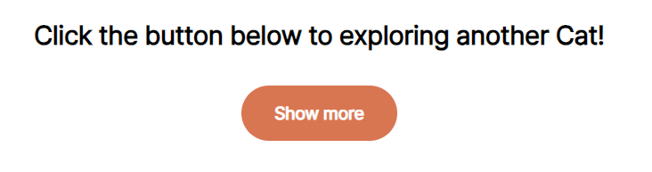
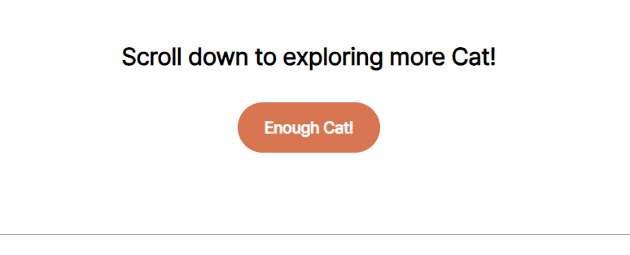
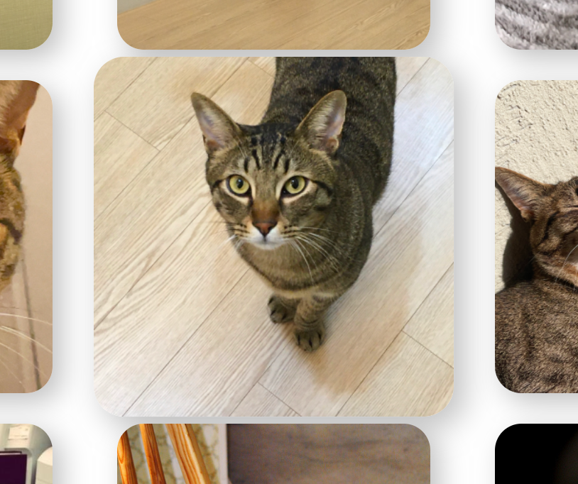
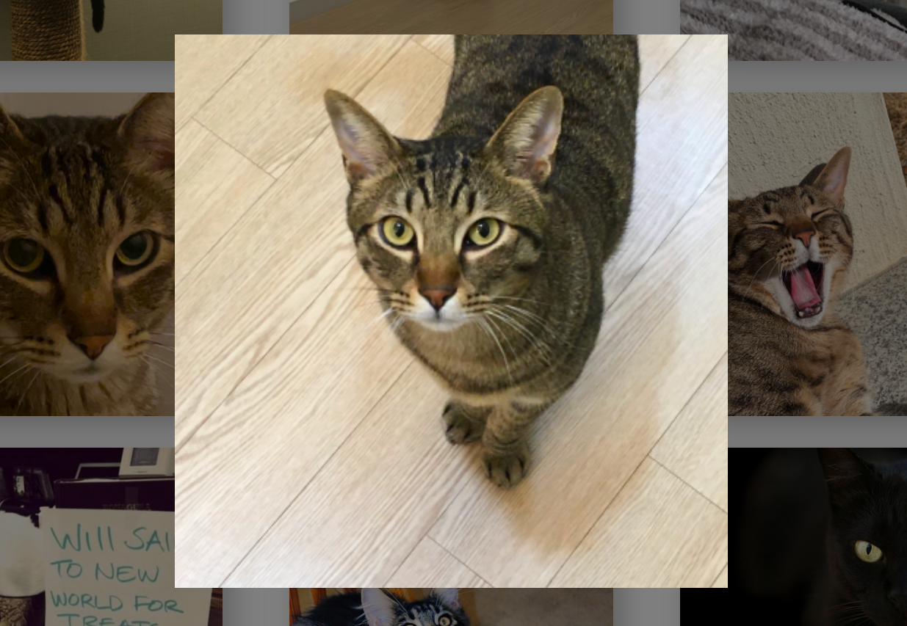
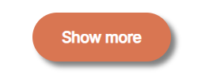
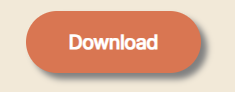
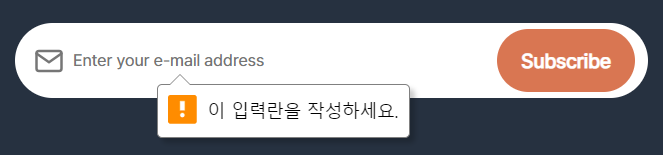
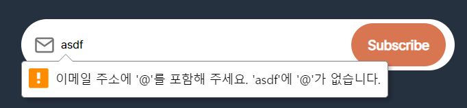
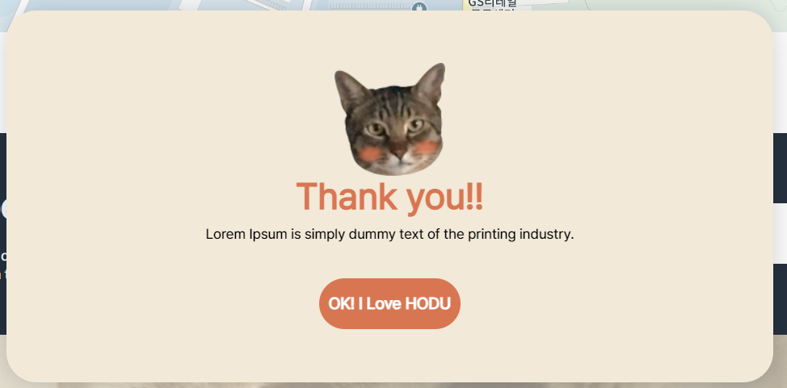
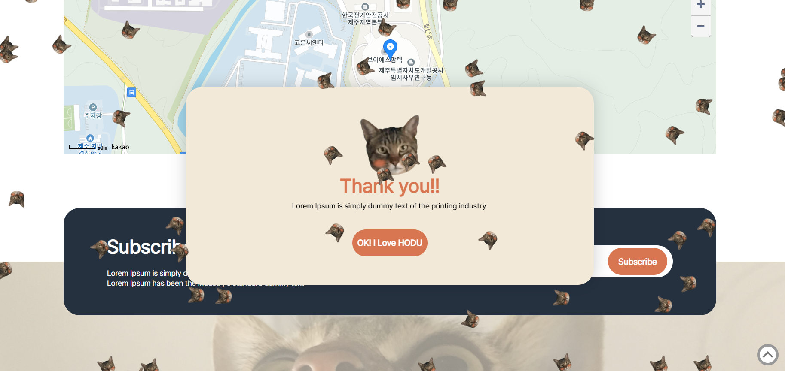

# FE-Project : HODU 렌딩 페이지 만들기 

#### 📑 [프로젝트 계획서](https://www.notion.so/oreumi/60c5d65a21d84cd89663d89cf06d89f6?p=e8a6ca930dbd4b2687b04f450cab1c44&pm=s)
## 🏁 [완성 페이지(gitPage)](https://bbabbungtting.github.io/oreumi4_FE/FinalProject/)

# **🎯 프로그래밍 요구 사항**

1. 최대한 학습한 내용을 바탕으로 구현을 목표로 한다.
    1. `ajax`, `dom` 적극적으로 활용
2. TIL 페이지에 프로젝트 진행 내용 매일 기록한다.
3. **최대한 의미있게, simantic 하게 코드를 작성한다.**
4. 깃허브에 올리고 코드를 지속적으로 관리한다.
5. API 연동해서 결과물을 UI로 출력한다.
    1. 카카오 지도 API, 사진 API
6. 불필요한 html 태그, css 사용을 지양한다

# **🛠 기능 목록**

## 🎨 CSS `css`

- ### `commom.css`
  - 공통적으로 적용되는 css (`wrapper` 등)
  - 구역을 나눌때 사용되는 css
  - 문자를 주로 다루는 태그들에 대한 css (`article` 등)
- ### `button.css`
  - 모든 버튼들에 대한 css
- ### `map.css`
  - 카카오 API에서 제공하는 지도 관련 css
- ### `form.css`
  - 이메일 입력 창에서 적용되는 css

## 💻 HTML`index.html`

- ### `index.html`
  - 기본 페이지에 대한 html

## 🕹 JavaScript `js`

- ### `btn-script.js`
  - [X] 이미지 무한 스크롤을 시작하는 기능
    - `Show more` 버튼 클릭 시 사진 무한 스크롤 시작
    - `Enough Cat!` 버튼 클릭 시 사진 무한 스크롤 정지

  - [X] 사진 클릭시 확대하는 기능
    - `show()` : 사진버튼 클릭시 사진 소스 활용해서 크게 띄운다
    - `imgEnter()` : 사진버튼에 커서가 올라가면 사진 크기 확대
    - `imgLeave()` : 사진버튼에서 커서가 사라지면 사진 크기 축소

  - [X] 이메일 입력 & 모달 띄우는 기능
    - 이메일 입력후 `subscribe` 버튼 클릭 시 `modal` 창 띄우기
      - 입력 후에 새로고침 방지 : `preventDefault()`
      - 입력 후에 입력창 초기화
    - 모달 창 버튼 클릭 시 모달 숨기기

  - [X] 위로가기 버튼
    - 기능 활성화/비활성화 구분해서 표현
    - 버튼 클릭 시 가장 위로 이동
- ### `img-load.js`
[The Cat API](https://thecatapi.com/) 에서 제공하는 API를 활용한 고양이 사진을 가져오는 JS
  - [X] `fetch`를 통해서 `json`안의 사진 `url`을 통해서 사진을 띄워 주는 기능
  - [X] 사진 무한 스크롤 기능
    - 쓰로틀 기능을 추가하여 반복 방지 
- ### `make-map.js`
[kakao developers](https://developers.kakao.com/)에서 제공하는 카카오맵을 사용하는 JS
  - [X] 기본적인 지도 나타내는 기능
  - [X] 지도 컨트롤 버튼 생성하는 기능
  - [X] 기본 마크 표시하는 기능
- ### `animation.js`
  - [X] 이메일 제출 시 애니메이션을 실행하는 기능

## 🗃 Assets `assets`
- **`images`** : 이미지
- **`fonts`** : 글씨 폰트

## 📮 결과물 제출
- 프로젝트 결과물은 [gitHub 주소](https://github.com/bbabbungtting/oreumi4_FE)로 공유
- 시연 링크 공유
  - [gitPage](https://bbabbungtting.github.io/oreumi4_FE/FinalProject/)를 통해 배포&제출
- [git commit 메시지](https://github.com/bbabbungtting/oreumi4_FE/commits?author=bbabbungtting) 는 단위 작업과 관련된 내용을 요약하여 작성

### 👉 [제출 링크](https://www.notion.so/oreumi/Front-End-97997e2842a54cb08f127420e48be512)

## 📝 나의 요구 사항

1. 파일들을 분리해서 가독성 좋게, 기능별로 나누기
2. 의미없는 `div` 사용 최대한 줄이기
3. 의미 있는 변수명, 클래스명, 함수명 사용하기
4. 범용성 있는 분할 하기
   1. mobile용 만들기 도전
   2. 반응형으로 만들어 보기
   
# 💡 주요 기능
- ### 사진 무한 스크롤
  1. `Show more` 버튼을 클릭하면 이미지 6개를 추가해서 보여준다.
  
        
  2. 사진이 담긴 `<ul>` 기준으로 150px 이상 스크롤을 내리면 새롭게 이미지를 6개씩 추가해서 보여준다.
     - Throttling(스로틀링)을 적용해서 한번에 많이 함수가 실행되지 않게 방지한다.
  3. `Enough Cat` 버튼을 클릭하면 모든 이미지 추가 기능을 멈춘다.
  
        
  
- ### 사진 확대 기능
  1. 사진에 커서를 가져다 대면(`mouseenter`) 커서가 바뀌고, 사진이 살짝 커진다.
  
        
  2. 클릭 하면 사진이 확대되어서 나타난다.

        
  3. 아무곳이나 다시 클릭하면 확대한 사진이 사라진다.
  4. `main photo` 안에 있는 사진들 모두 확대 가능하다.
- ### 버튼 `mouseenter` 기능
  1. 버튼에 커서를 가져다 대면(`mouseenter`) 커서가 바뀌고, 음영이 생긴다.

        
        
  2. 버튼에서 커서를 치우면(`mouseleave`) 다시 원래대로 돌아온다.
- ### 이메일 제출 기능
  1. 이메일 형식에 맞게 입력하지 않으면 제출 되지 않는다.

        
        
  2. 제출 하면 `modal`이 나타난다.
     - 제출시 입력 칸이 초기화 된다.
     
     
  3. `modal`이 나타나면서 애니메이션이 실행된다.
  
     
  4. `OK! I Love HODU` 버튼을 누르면 `modal`이 없어진다.
- ### 위로 가기 버튼
  1. 위로가기 버튼이 항상 오른쪽 하단에 위치한다.
  2. 처음에는 버튼이 활성화 되어있지않다.
     - 커서가 변하지 않는다.
     - 연한 회색으로 구성된다.

     
  3. 스크롤을 통해서 윈도우 창 가장 위쪽 기준으로 `10px` 이상 내렸을 경우 활성화된다.
     - 커서가 변한다.
     - 진한 회색으로 구성된다.
     
     